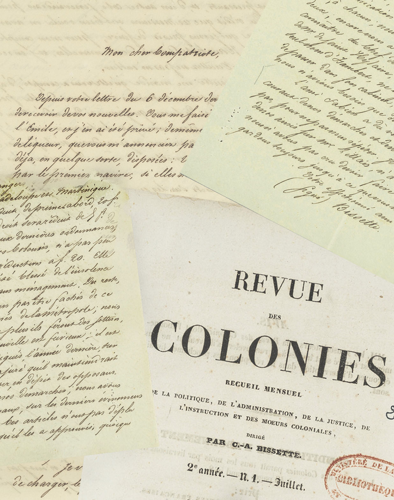

  
  

Friday, February 14, 2025

2:00 PM - 6:00 PM (Paris Time) | 9:00 AM - 1:00 PM (Fort-de-France Time) | 8:00 AM - 12:00 PM (EST)

Aix-en-Provence, Archives nationales d’outre-mer (ANOM) | Fort-de-France, Archives territoriales de Martinique (ATM) | Live on YouTube

Organized in partnership with the Archives nationales d’outre-mer and the Archives territoriales de Martinique, this conference accompanies the launch of the traveling exhibition _The Revue des Colonies: Diaspora + Abolition_, which will travel from Aix-en-Provence (February 2025) to Fort-de-France (May 2026).

Bringing together members of the digital edition and translation project of the _Revue des Colonies_ (1834–1842)—the first French periodical directed by people of color—this event highlights a little-known yet essential document for understanding the transnational dynamics of the global struggle against colonial slavery.

The presentations will examine the _Revue des Colonies_ through its key figures, editorial strategies, and cultural and political ambitions, with particular attention to the tensions of the period, shaped by aspirations for emancipation and the realities of imperialist domination.

**Register to attend the event online: https://www.eventbrite.com/e/the-revue-des-colonies-diasporic-networks-and-the-struggle-for-abolition-tickets-1118269346719**

### Speakers:
* Jessica Balguy (Carnegie Mellon University)
* Maria Beliaeva Solomon (University of Maryland)
* Jacqueline Couti (Rice University)
* Laure Demougin (Université Paul-Valéry Montpellier 3)
* Abel Louis (Société d’histoire de la Martinique)
* Yasmine Najm (Leipzig University)
* Grégory Pierrot (University of Connecticut)
* Michaël Roy (Université Paris Cité)
* Chelsea Stieber (Tulane University)

With the generous support of the Archives territoriales de Martinique, the Bibliothèque nationale de France, the National Historical Publications and Records Commission, the Fondation pour la Mémoire de l’Esclavage, the University of Maryland, the Maryland Institute for Technology in the Humanities, Tulane University, and the Schomburg Center for Research in Black Culture of the New York Public Library.
