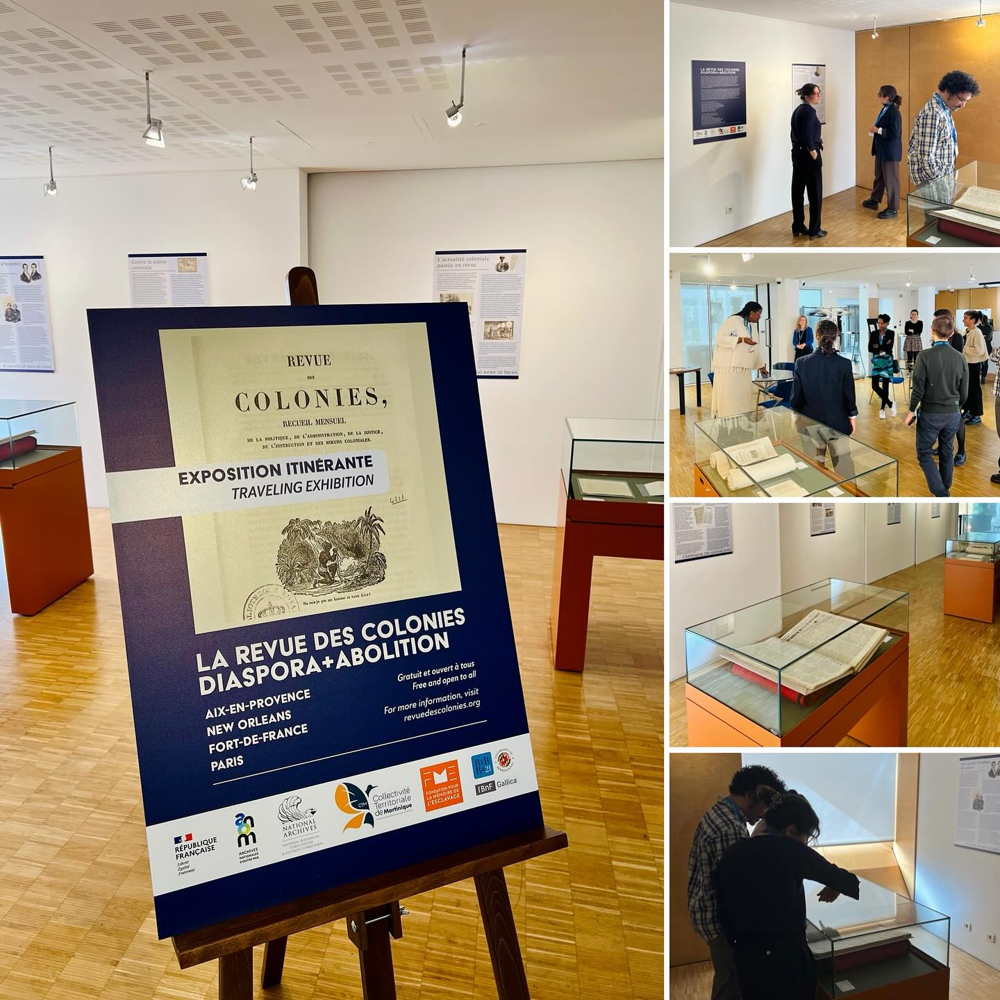
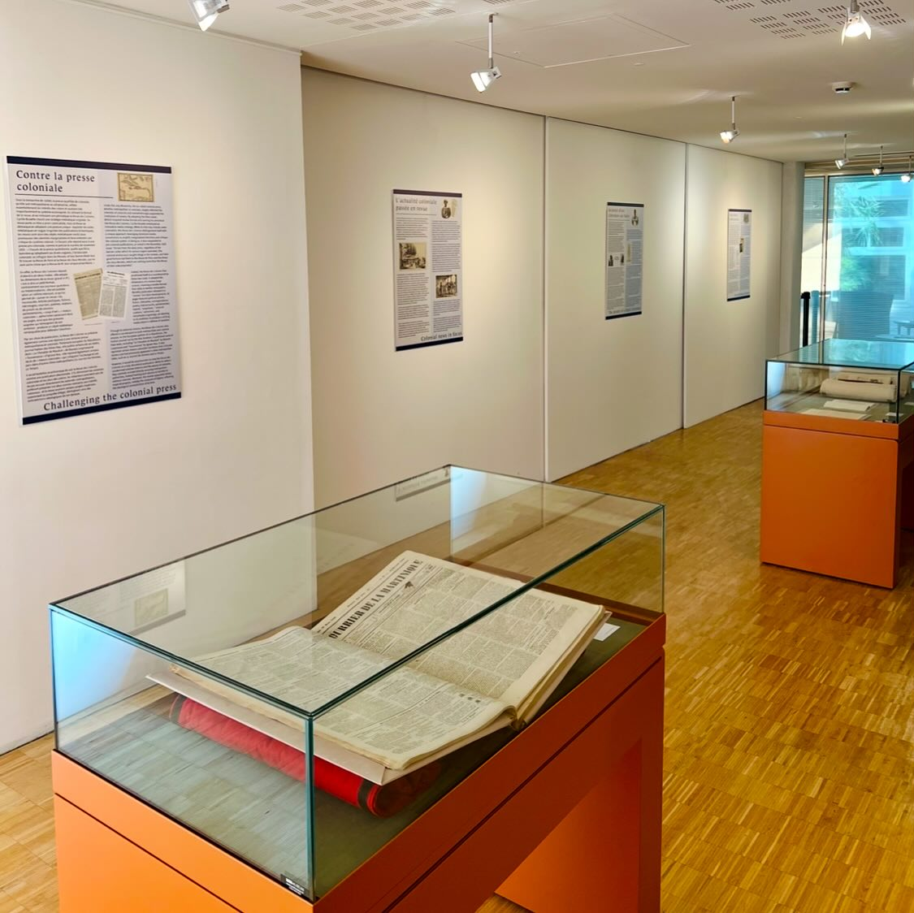
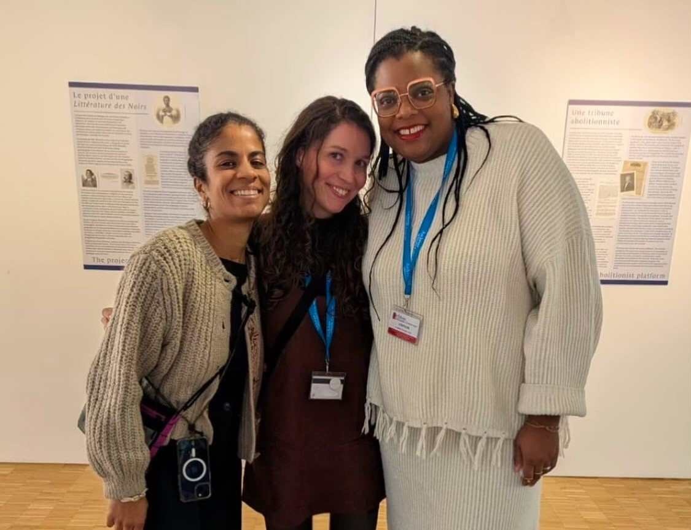
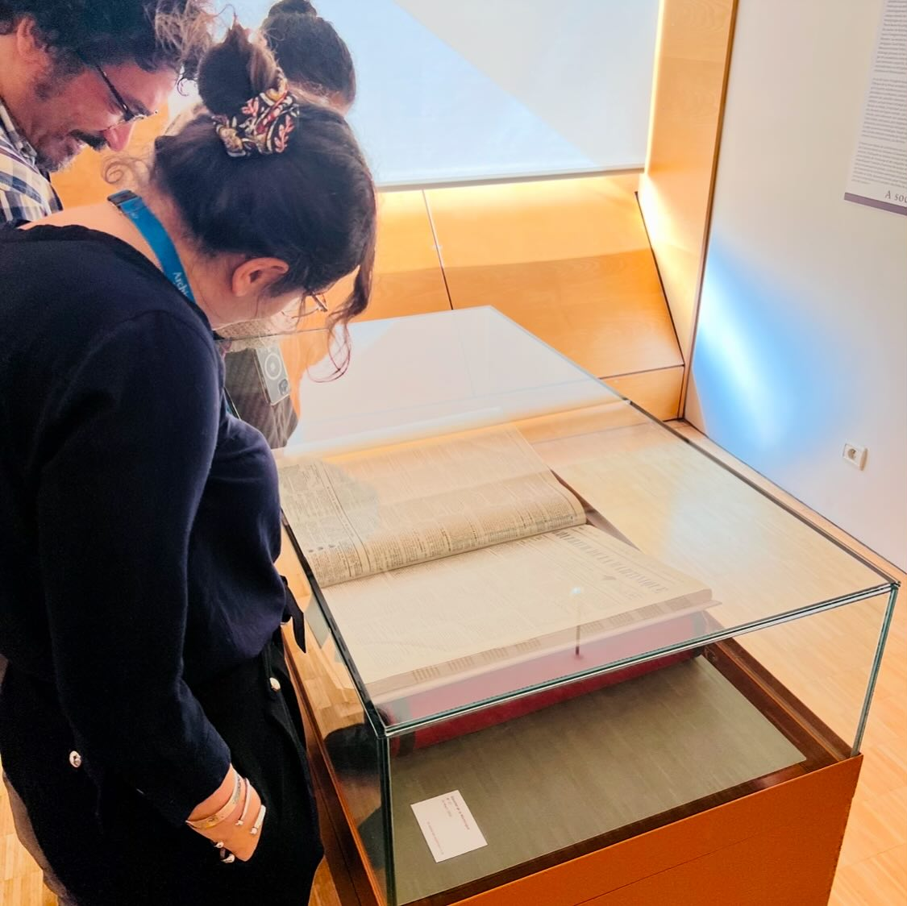

  
    

  

  
    

  

On Friday, February 14, the traveling exhibition *La Revue des Colonies: Diaspora + Abolition* was inaugurated at the Overseas National Archives (ANOM) in Aix-en-Provence, marking the start of a journey that will take it to the Territorial Archives of Martinique (ATM) in Fort-de-France by 2026. Through a selection of archival documents, excerpts, and illustrations, this exhibition sheds light on the *Revue des Colonies*, Cyrille Bissette's abolitionist periodical, highlighting its diverse sections, dissemination strategies, committed contributors, and its crucial role in the global antislavery movement.  

  
    

  

The event featured a musical address by Valérie-Ann Edmond Mariette, a doctoral candidate in history at the Université des Antilles and a specialist in the rememberance of slavery and musical practices in the Caribbean. Her research explores the role of music as a sonic memorial to colonial legacies. Her presentation provided fascinating insight into the musical heritage linked to Bissette—an overlooked figure in Martinique’s abolitionist history—while also underscoring the memorial stakes raised by the exhibition and their relevance to contemporary debates.  

The exhibition is open to the public at the Overseas National Archives in Aix-en-Provence until March.  

  
    

  

  
    

  

This initiative is the result of a curatorial collaboration including Jessica Balguy (Carnegie Mellon University), Maria Beliaeva Solomon (University of Maryland), Laure Demougin (Université Paul-Valéry Montpellier 3), Valérie-Ann Edmond Mariette (Université des Antilles PHEEAC-CIRESC), Grégory Pierrot (University of Connecticut), Michaël Roy (Université Paris Cité), and Chelsea Stieber (Tulane University).  

The exhibition also benefits from the support of a scientific advisory board composed of Audrey Célestine (New York University), Myriam Cottias (CNRS PHEEAC-CIRESC), Marlene Daut (Yale University), Brent H. Edwards (Columbia University), Sara K. Johnson (University of California San Diego), Claire Parfait (Université Sorbonne Paris Nord), Marie-Jeanne Rossignol (Université Paris Cité), and Marie-Ève Thérenty (Université Paul-Valéry Montpellier 3).