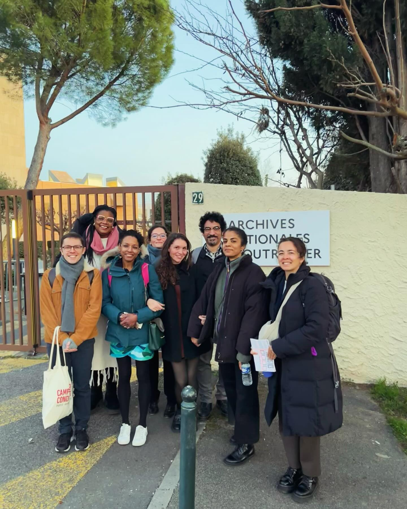
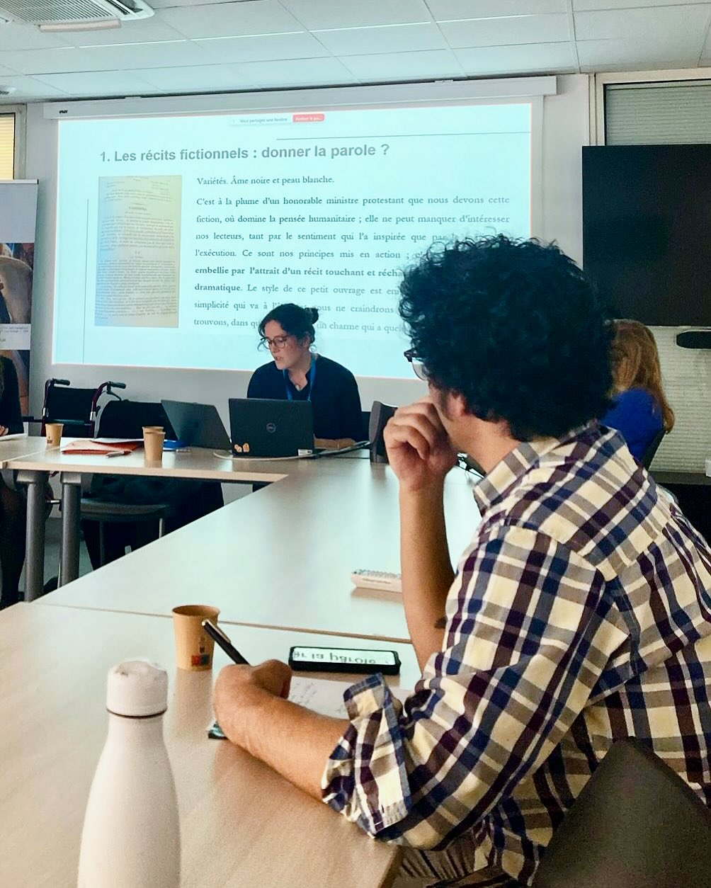
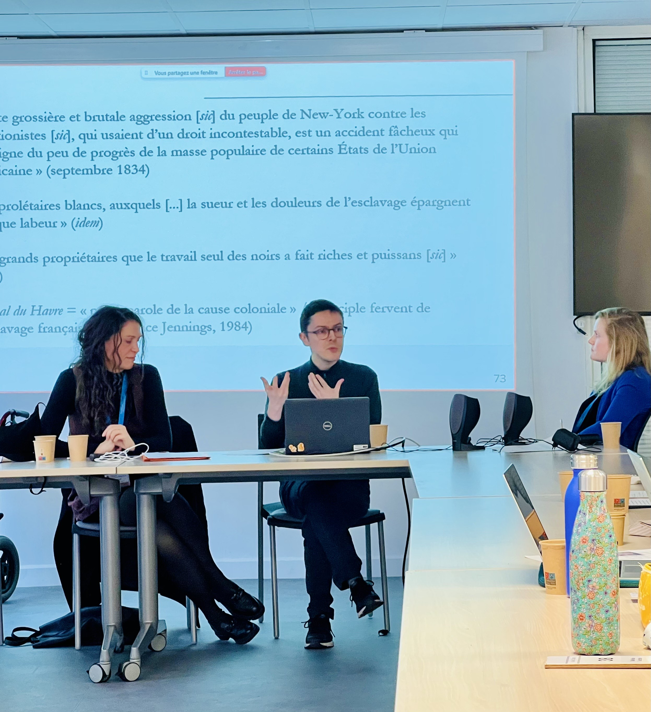
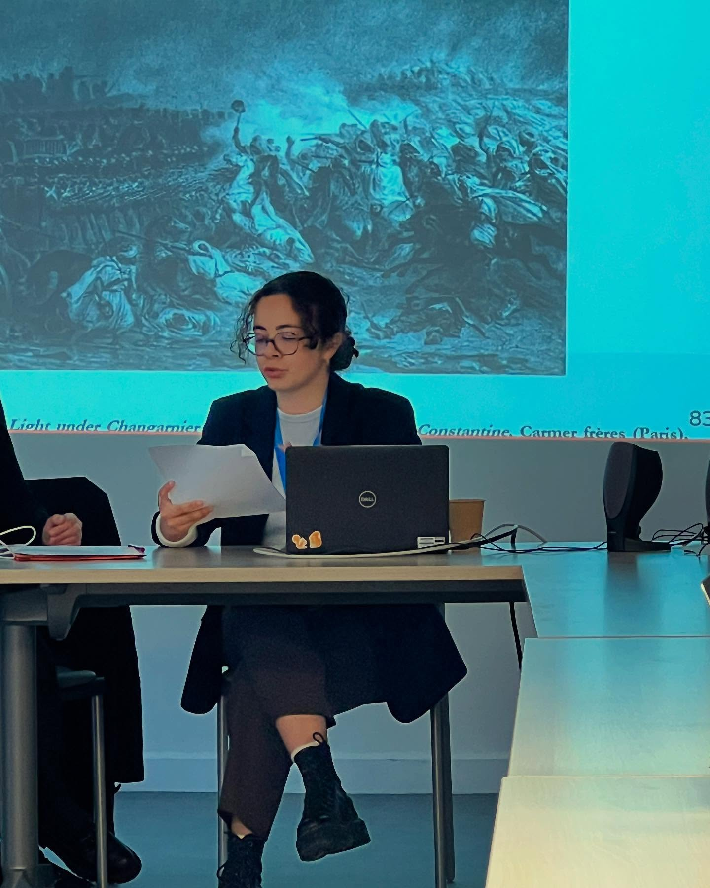

  
<iframe style="width: 100%; height: 30vh" src="https://www.youtube.com/embed/q_jGZZXbYpg?si=Ugv22Gnl2Aq648b5" title="YouTube video player" frameborder="0" allow="accelerometer; autoplay; clipboard-write; encrypted-media; gyroscope; picture-in-picture; web-share" referrerpolicy="strict-origin-when-cross-origin" allowfullscreen></iframe>

  
  

L’enregistrement du colloque *La Revue des Colonies : Réseaux diasporiques et combats abolitionnistes*, qui s’est tenu le vendredi 14 février 2025, est désormais disponible sur YouTube !

Cette rencontre a permis d’explorer la *Revue des Colonies* sous différents angles, en mettant en lumière son rôle dans les luttes abolitionnistes et les dynamiques intellectuelles du XIXe siècle.  

Le colloque s’est ouvert avec Abel Louis (Société d’histoire de la Martinique), qui, s’exprimant depuis les Archives territoriales de Martinique (ATM), a retracé les multiples facettes de Cyrille Bissette, entre engagement politique, stratégies éditoriales et positionnements au sein des cercles abolitionnistes. Poursuivant cette réflexion, Jacqueline Couti (Rice University) a analysé les prises de position de Bissette en tant que critique littéraire et la manière dont il mobilisait la littérature pour servir son combat abolitionniste.  

  
      
  
  
      
  

Un second panel a porté sur les contenus littéraires du périodique et ses stratégies discursives. Grégory Pierrot (University of Connecticut) a exploré la place des fictions révolutionnaires haïtiennes dans la *Revue des Colonies*, tandis que Maria Beliaeva Solomon (University of Maryland) a étudié le projet de façonner et promouvoir un panthéon littéraire noir, au sein d'une des ses rubriques. Laure Demougin (Université Paul-Valéry Montpellier 3) a interrogé les stratégies médiatiques et éditoriales mises au service de l’abolitionnisme, et Noëlle Romney (Université Sorbonne Nouvelle) a mis en lumière les enjeux de traduction et la circulation transnationale des idées dans le périodique.  

  
      
  
  
      
  

Enfin, un troisième panel a abordé les enjeux politiques de la *Revue des Colonies*. Chelsea Stieber (Tulane University) a analysé la place de la première émancipation dans le programme antiesclavagiste du périodique, tandis que Michaël Roy (Université Paris Cité) a examiné ses réseaux internationalistes et leurs implications politiques. Yasmine Najm (Leipzig University) s’est penchée sur le traitement de la conquête de l’Algérie dans ses pages, et Jessica Balguy (Carnegie Mellon University) a questionné la position de Bissette sur l’indemnité coloniale et les tensions qu’elle révélait au sein du mouvement abolitionniste.  

Ces interventions ont donné lieu à des échanges nourris, offrant une relecture approfondie de ce périodique fondamental et des combats qu’il a portés.  

Nous adressons nos vifs remerciements aux Archives nationales d’outre-mer (ANOM) à Aix-en-Provence et aux Archives territoriales de Martinique (ATM) à Fort-de-France pour leur accueil et leur soutien précieux dans l’organisation de cet événement.

